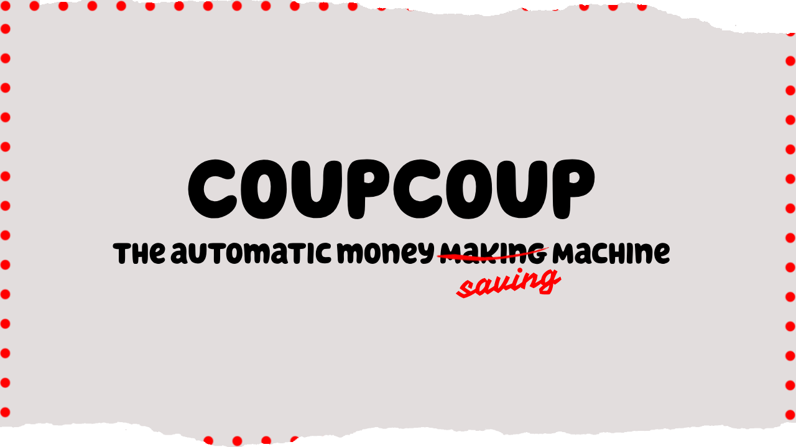

<h1 align="center">



CoupCoup
</h1>
<span align="center">
  
An automated money ~~making~~ saving machine, powered by AI

_Saving Money is **NEVER** Coo-Coo!_
  
</span>

<hr />
<h2 align="center">
  The Concept
</h2>

### TLC's ["Extreme Couponing"](https://en.wikipedia.org/wiki/Extreme_Couponing)


The first inspiration for this project came from watching the TLC show "Extreme Couponing". 

The show follows people who have mastered the art of couponing, and are able to get hundreds of dollars worth of groceries for just a fraction of their cost. It highlights the process by which they do this, and the sacrifices they make to achieve it.

People on the show often spend hours each week clipping coupons, organizing them, and planning their shopping trips. They also often have to go to multiple stores to get the best deals. It's a ritual of savings, highlighted by the often "extreme" lengths that people go to in order to save money.


### The Opportunity

When I approached the iteration of this project, my main idea centered around the concept of automatically analyzing the weekly ads for each store, and comparing them to a list of manufacturer coupons. 

It relied strictly on utilizing regex based extraction to parse everything from product names to oxford comma separated lists. The problem with this approach was that it was too rigid, and required a lot of manual intervention to get the data in the right format. The data could never be standardized, and the program was too slow to be useful.

### Then and Now


Now, 14 years after the show first aired, the world is a different place. 

The internet has made it easier than ever to find deals, and the rise of AI has made it possible to automate many of the tasks that were once done by hand.
What took the extreme couponers of the past hours to do, can now be done in minutes by Generative AI. 

<hr />

<h2 align="center">
  The Project
</h2>


### Extreme Couponing as a Concept

Understanding how CoupCoup works requires an understanding how "Extreme Couponing" works.

The process of extreme couponing can be broken down into a few key steps:

1. **Reading the Weekly Ads**: The first step in extreme couponing is to read the weekly ads for each store. This is where you find out what's on sale, and what deals are available.
2. **Finding Coupons**: The next step is to find coupons that match the items on sale. This can be done by clipping coupons from newspapers, printing them from websites, or using digital coupons.
3. **Matching Coupons to Sales**: The final step is to match the coupons to the sales. This is where the real savings happen, as you can often get items for free or even make money by using coupons on items that are already on sale.
4. **Determining if a Deal is Worth It**: The final step is to determine if a deal is worth it. This involves calculating the total cost of the items, factoring in the coupons, and comparing it to the regular price.
5. **Planning the Shopping Trip**: The final step is to plan the shopping trip. This involves making a list of the items you want to buy, organizing your coupons, and deciding which stores to visit.
6. **Executing the Plan**: The final step is to execute the plan. This involves going to the store, buying the items, and using the coupons to get the best deals.

Any one of these steps can be time-consuming and tedious, but when done right, the savings can be substantial. With the right tools, it's possible to automate many of these steps, and save time and money in the process.

### CoupCoup as a Solution
CoupCoup removes a lot of the many manual steps involved in the process of extreme couponing. It automates the process of reading the weekly ads, finding coupons, matching coupons to sales, and determining if a deal is worth it.

CoupCoup performs the following:

1. **Reading the Weekly Ads**: CoupCoup uses web scraping to read the weekly ads for each store. It extracts the items on sale, the prices, and any other relevant information. 
2. **AI Analysis and Extraction**: CoupCoup uses Google's Gemini API (via Vertex or AI Studio) to analyze the weekly ads and extract the items on sale.
    - Function Calling: By utilizing Gemini's Function Calling feature, we're able to utilize the power of the LLM to provide a structured output of the weekly ads.
3. **Finding Coupons**: CoupCoup uses web scraping to find coupons that match the items on sale. It extracts the coupons, the items they apply to, and any other relevant information.
4. **AI Analysis and Extraction**: CoupCoup uses Google's Gemini API (via Vertex or AI Studio) to analyze the coupons and extract the items they apply to.
    - This happens on both a "Global" and a "Store" level. The "Global" level is for manufacturer coupons, while the "Store" level is for store specific coupons.
5. **Matching Coupons to Sales**: CoupCoup uses AI to match the coupons to the sales. It compares the items on sale to the items the coupons apply to, and determines if a match is found.
6. **Route Planning**: By using [OpenRouteService](https://openrouteservice.org/), CoupCoup is able to plan the most efficient route to visit the stores with the best deals. **API Key Required**
    - The route is constructed based on locality information that you provide. Please note that this feature relies on the OpenRouteService API - and may not always be accurate.
7. **Directions Generation**: CoupCoup then creates a single-page HTML that contains the directions to each store. You can also view the deals that are available at each store.


<hr />

<h2 align="center">
  Setting Up CoupCoup
</h2>

### Requirements

`poetry` is required to install the dependencies for this project. You can install it by running:

```bash
pip install poetry
```

### Installation

To install the dependencies for this project, run:

```bash
poetry install
```

### Configuration

To get an example configuration file, view `config.example.ini`. You can copy this file to `config.ini` and fill in the necessary information.

- Under the `config` section:
    - One of the following must be provided:
      - `GOOGLE_API_KEY`: Your Google AI Studio API Key
      - `GOOGLE_PROJECT_ID`: Your Google Vertex AI Project ID
    - `INCLUDED_STORES`: A JSON list of stores that you want to include in the analysis. If this is not provided, no stores will be included.
    - `COUPON_SOURCES`: A JSON list of coupon sources that you want to include in the analysis. If this is not provided, no coupon sources will be included.
- Under the `directions` section:
    - `openrouteservice_api_key`: Your OpenRouteService API Key [Get one here](https://openrouteservice.org/sign-up/) 
    - **Any of the properties listed at [OpenRouteService's Structured Geocoding Endpoint](https://openrouteservice.org/dev/#/api-docs/geocode/search/structured/get) can be included in this section.**
    - `locality`: The locality that you want to search for stores in. 
    - `country`: The country that you want to search for stores in. 
    - `postalcode`: The postal code that you want to search for stores in.
    - `address`: The street that you want to search for stores in.
    - `state`: The state that you want to search for stores in.

The store sections are unique, and may not need to be edited. If you were to change something, consider changing the `store_code` section where applicable.

### Running CoupCoup

To run CoupCoup, you can use the following command:

```bash
poetry run python __main__.py
```

This will run the base script - running through your INCLUDED_STORES and COUPON_SOURCES, and generating a route based on the locality information you provided.

### Output

